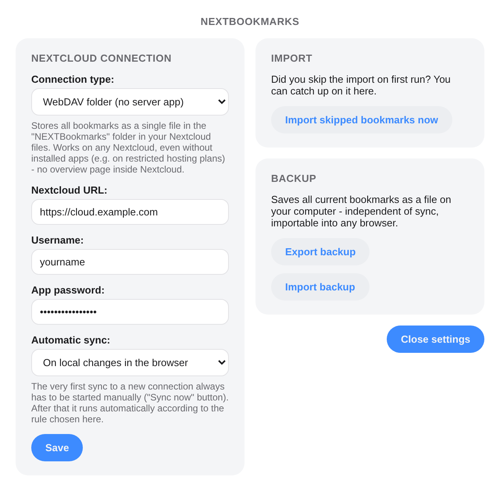
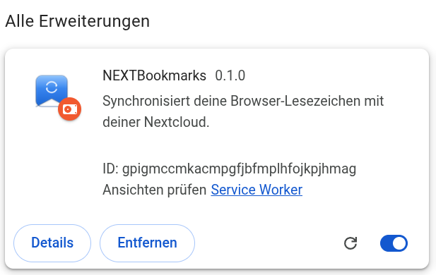
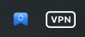
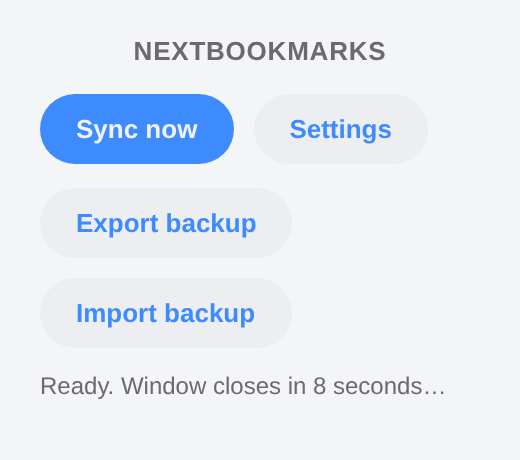

[Deutsch](README.md) | [English](README.en.md) | [Changelog](#changelog) | [TODO](TODO.md) (German)

# NEXTBookmarks – Scaffold

A tool that keeps browser bookmarks in sync centrally through a self-hosted
Nextcloud – independent of browser and operating system.

This project was built in collaboration with [Claude](https://claude.com).

**Install:**
[Chrome Web Store](https://chromewebstore.google.com/detail/gkkfjlpedobidkhcihppighdomkjcihl) ·
[Firefox Add-ons](https://addons.mozilla.org/firefox/addon/nextbookmarks/)

## How the two parts work together

```
Chrome/Firefox/Edge  --(REST API over HTTPS)-->  Nextcloud app "nextbookmarks"
 (browser-extension/)                             (nextcloud-app/, PHP)
                                                          |
                                                     Nextcloud database
```

- **nextcloud-app/**: Runs on your Nextcloud server. Stores all bookmarks in
  its own database table and exposes them via a REST API. It also shows a
  simple web UI inside Nextcloud.
- **browser-extension/**: Runs in the user's browser, reads the local
  bookmarks (`chrome.bookmarks` API, also supported by Firefox) and sends
  new bookmarks to the REST API.

Because the extension only uses standard web technologies (WebExtension API,
fetch), it runs unchanged or with minimal adjustments in Chrome, Firefox and
Edge. And because the app logic lives in Nextcloud, the server's operating
system doesn't matter.

## Two connection types

In the extension settings, the "Connection type" field lets you choose how
syncing happens:

- **Nextcloud app (App Store)**: uses the REST API of the installed
  `nextcloud-app` (see above) – fine-grained, with its own web UI inside
  Nextcloud. Requires the app to be installed on the server (see
  "Installing the Nextcloud app" below).
- **WebDAV folder (no server app)**: stores all bookmarks as a single file
  in the `NEXTBookmarks` folder in your Nextcloud files, via the standard
  WebDAV protocol. **Nothing needs to be installed on the server for
  this** – works on any Nextcloud you have a username + app password for,
  even managed offerings without SSH/App Store access (e.g. Hetzner Storage
  Share). The trade-off: no overview page inside Nextcloud, and
  finer-grained conflict detection isn't possible due to technical
  WebDAV/CORS limitations (see "Known limitations" below).

Both connection types share the same sync logic (two-way sync, conflict
resolution, safety net etc., see below) – the difference is only in
where/how the bookmarks are stored on the server.



## Folder structure

```
nextbookmarks/
├── nextcloud-app/
│   ├── appinfo/
│   │   ├── info.xml         # App metadata (name, version, ...)
│   │   └── routes.php       # URL -> controller mapping
│   ├── lib/
│   │   ├── AppInfo/Application.php   # App entry point
│   │   ├── Controller/
│   │   │   ├── BookmarkController.php  # REST API (for the extension)
│   │   │   └── PageController.php      # Web UI inside Nextcloud
│   │   ├── Db/
│   │   │   ├── Bookmark.php         # Data model
│   │   │   └── BookmarkMapper.php   # Database access
│   │   └── Migration/               # Creates the DB table
│   ├── templates/main.php    # HTML of the web UI
│   ├── js/app.js             # JS of the web UI
│   ├── css/style.css
│   └── composer.json
└── browser-extension/
    ├── manifest.json         # Extension configuration
    ├── background.js         # Sync logic (core piece, both connection types)
    ├── export-backup.js      # Local + cloud backup (export/import)
    ├── theme.css             # Shared look (light/dark)
    ├── popup.html / popup.js # Popup menu ("Sync now" etc.)
    ├── options.html / options.js  # Settings (server URL, credentials, ...)
    ├── onboarding.html / onboarding.js  # Import prompt after installation
    └── _locales/de, _locales/en  # Translations (German/English)
```

## Installing the Nextcloud app

This section only applies to the **"Nextcloud app (App Store)"** connection
type (see "Two connection types" above). If you use **"WebDAV folder (no
server app)"** instead, you can skip this section entirely – it requires no
installation on the server at all, you just enter the Nextcloud URL,
username and app password directly in the browser extension.

For the App Store variant, the app itself is identical in both cases – the
difference is only how much access you have to the server Nextcloud runs
on.

### A) Self-hosted Nextcloud (your own server or VPS)

This means any Nextcloud installation where you (or your admin) have full
file and terminal access to the server – whether it's your own hardware, a
Raspberry Pi at home, or a rented, unmanaged server (e.g. a "Hetzner Cloud
Server" on which you installed Nextcloud yourself).

1. Connect to the server via SFTP/SSH.
2. Rename the `nextcloud-app` folder to `nextbookmarks` and copy it into the
   `apps/` folder of your Nextcloud installation (typically
   `/var/www/nextcloud/apps/nextbookmarks`).
3. Set permissions so the web server user can read the files, e.g.:
   ```
   chown -R www-data:www-data /var/www/nextcloud/apps/nextbookmarks
   ```
   (the username may also be `apache` or similar depending on the server.)
4. Enable the app – either via the web UI (Settings → Apps →
   "Disabled apps" → enable "NEXTBookmarks") or via the console:
   ```
   sudo -u www-data php occ app:enable nextbookmarks
   ```
5. Under Nextcloud settings → Security, generate an **app password** (don't
   use your regular password!) – you'll need it in the browser extension in
   a moment.

### B) Nextcloud with a hosting provider (e.g. Hetzner Managed Nextcloud)

Many providers offer a **managed** Nextcloud instance (you only get a
Nextcloud account, no server/SSH access). There, usually **only the official
Nextcloud App Store** can be used via the web UI.

**Good news: NEXTBookmarks has been listed in the official Nextcloud App
Store since August 2026** –
[apps.nextcloud.com/apps/nextbookmarks](https://apps.nextcloud.com/apps/nextbookmarks).
On any Nextcloud (even managed, even **Hetzner Storage Share**) it's
enough to search for "NEXTBookmarks" under Settings → Apps and click
Enable – no SSH/root access, no SFTP, no provider support ticket needed.

Only if your provider disallows App Store apps for some other reason, or
you simply don't want to install anything on the server at all, the
**"WebDAV folder (no server app)"** connection type (see "Two connection
types" above) remains available as an alternative that needs no
server-side installation whatsoever.

In all cases: once the app is active, just enter the Nextcloud URL, your
username and an app password in the browser extension (see below) – the
extension doesn't care whether Nextcloud is self-hosted or with a provider.

### C) Quick test: local Nextcloud via Docker on your PC

If you (like with Hetzner Storage Share) don't have your own server but
still want to test, a local test instance via Docker is the fastest, free
way – completely independent of your production Hetzner cloud.

**Prerequisite**: [Docker Desktop](https://www.docker.com/products/docker-desktop/)
installed (Windows, Mac or Linux).

1. Open a terminal and start a test Nextcloud:
   ```
   docker run -d --name nextcloud-test -p 8080:80 -v nextcloud-test-data:/var/www/html nextcloud
   ```
2. Open `http://localhost:8080` in your browser and create an admin account.
3. Copy the app into the container and enable it:
   ```
   docker cp nextcloud-app nextcloud-test:/var/www/html/apps/nextbookmarks
   docker exec -u www-data nextcloud-test php occ app:enable nextbookmarks
   ```
   (If `chown` errors occur: `docker exec nextcloud-test chown -R www-data:www-data /var/www/html/apps/nextbookmarks`)
4. Under `http://localhost:8080` → Settings → Security, generate an app
   password.
5. In the browser extension, enter `http://localhost:8080` as the Nextcloud
   URL (the manifest specifically allows `http://localhost/*` for this,
   otherwise only `https://` is allowed by default).

The test instance runs completely isolated in Docker – it has nothing to do
with your real Hetzner cloud, and you can remove it any time with
`docker rm -f nextcloud-test`.

## Loading the browser extension

Easiest way: install directly from the store (see links above) – the
Chrome Web Store listing also works in Vivaldi/Edge/Brave/Opera. For
development, or to test a locally modified version:

1. Chrome/Edge: open `chrome://extensions` → enable "Developer mode" →
   "Load unpacked" → select the `browser-extension` folder. The extension
   then shows up in the "All extensions" list (screenshots below show the
   German UI, the default locale; English is fully supported too):

   
2. In the extension settings, enter the Nextcloud URL, your username and
   the app password.
3. Click the extension icon in the toolbar

   

   → "Sync now".

## What already works

- **Two-way sync**: new bookmarks are transferred in both directions,
  changes (title, folder) as well, and deletions are propagated to the
  other side.
- **Conflict resolution** (deliberately kept simple): if a bookmark was
  changed on both sides since the last sync, the side with the newer
  timestamp wins. Since browsers don't provide a reliable, consistent
  "last modified" time for individual bookmarks, this is a pragmatic
  approximation – good enough for everyday use; for production use, a
  proper, versioned reconciliation would be the next step.
- **No central "master"**: Nextcloud isn't a preferred master that the
  browser blindly follows, but the shared store through which multiple
  devices reconcile with each other – changes flow in both directions,
  decided per bookmark (see conflict resolution above). This works because
  the sync doesn't just compare "local vs. server", but also takes into
  account the *last known state* from the previous sync (`syncState`, see
  the comment at the top of `background.js`). If you set up the extension
  on a new/empty device, every cloud bookmark is "new, never seen" for that
  device (since its `syncState` is empty) → it gets downloaded, not
  deleted. Something only gets deleted if a device actively remembers "I
  used to know this locally, now it's gone".
- **Folder structure**: the folder path (e.g. `Bookmarks Bar/Work`) is
  transferred as well; missing folders are created locally automatically
  when downloading.
- **Automatic sync (configurable)**: choose in the settings between "On
  local changes in the browser" (debounced, 5 seconds after the last
  change) and "When closing the browser" (best-effort, see the note at the
  `chrome.windows.onRemoved` listener in `background.js` - not always
  reliable during an actual browser shutdown). A background sync also runs
  every 15 minutes (`browser.alarms`). **The very first sync to a new
  connection always has to be started manually via the "Sync now"
  button** – only after that does the automatic rule take over. This lets
  you check that the correct server/account is configured before the first
  (potentially consequential) automatic run.
- **Backup export/import**: export saves all current bookmarks as an HTML
  file in Netscape Bookmark format (importable into any browser) – locally
  on your computer and additionally uploaded automatically to the cloud
  (`NEXTBookmarks/backups/`, via WebDAV, independent of the chosen
  connection type). Importing a backup creates the contained bookmarks in a
  new, isolated folder, without altering existing bookmarks.
- **Safety net against mass deletion**: if a sync would delete more than
  half of the known bookmarks (e.g. because the wrong server/account was
  entered by mistake), it aborts completely instead of carrying out the
  deletion, with an error message prompting you to check your credentials.
- **Cross-browser compatibility**: `browser-polyfill-shim.js` lets the same
  code consistently use `browser.*` (promises), even in browsers that only
  offer the older, callback-based `chrome.*`. `manifest.json` deliberately
  lists both `service_worker` (Chrome/Edge/Vivaldi/Brave/Opera) and
  `scripts` (needed by Firefox for MV3 background scripts, since Firefox
  doesn't use a true service worker there) for the background process.
  - **Chromium-based browsers** (Chrome, Edge, Vivaldi, Brave, Opera):
    live-tested - the extension loads, the service worker starts, all
    pages (popup/settings/onboarding) and the bookmark sync message work
    without errors.
  - **Firefox**: live-tested (temporary add-on via `about:debugging`,
    including a connection to a real Nextcloud) - works. Publishing to the
    Firefox store would additionally require the regular signing/publishing
    process; the `gecko.id` in the manifest
    is already prepared for that.
  - **Safari**: currently not supported - see the note further below.
- **Onboarding import prompt**: right after installation (or as soon as you
  save the Nextcloud credentials in the settings), `onboarding.html` opens
  automatically asking whether your existing local bookmarks should be
  imported.
  - **Yes** → immediately triggers a sync, all existing bookmarks are
    uploaded.
  - **No** → these bookmarks are permanently ignored by the sync (neither
    uploaded nor downloaded). You can catch up on this any time via the
    "Import skipped bookmarks now" button in the settings.
- **Icon**: `browser-extension/icons/` contains a blue icon in 16/48/128px
  (bookmark shape with sync arrows), generated from `icon-source.svg`. The
  same icon also lives under `nextcloud-app/img/` for the web UI.
- **Popup menu**: closes itself automatically after 10 seconds of
  inactivity (with a visible countdown "Window closes in ... seconds"),
  any click resets the timer. From here you can trigger a sync, open
  settings (opens as its own, appropriately sized window instead of a
  browser tab), and export/import a backup.

  
- **Web UI** (inside Nextcloud, "NEXTBookmarks" menu item): bookmarks are
  displayed grouped by folder; clicking a folder expands the title (bold)
  and URL (clickable, opens in a new tab) of the contained bookmarks.
  Folders appear in the same order as in the browser's bookmark tree, trash
  folders are always sorted to the end. The text color automatically
  adapts to the active Nextcloud theme (light/dark).

## Development / testing local changes

If you're continuing to work on the code and want to check via the Docker
test instance (see section C above) whether a change works:

1. Copy the changed file into the running container, e.g.:
   ```
   docker cp nextcloud-app/js/app.js nextcloud-test:/var/www/html/apps/nextbookmarks/js/app.js
   docker exec nextcloud-test chown www-data:www-data /var/www/html/apps/nextbookmarks/js/app.js
   ```
2. **Only for changes to a migration** (new/changed column in
   `lib/Migration/`), additionally disable/enable the app once so the
   migration runs:
   ```
   docker exec -u www-data nextcloud-test php occ app:disable nextbookmarks
   docker exec -u www-data nextcloud-test php occ app:enable nextbookmarks
   ```
3. **Watch out for browser caching**: Nextcloud serves `js/app.js` and
   `css/style.css` with a very long `Cache-Control` header (several
   months). After every change to these two files, make sure to hard-reload
   with **Ctrl+Shift+R**, otherwise it will look like nothing changed even
   though the server has long been serving the new version.
4. Changes to `browser-extension/*.js` don't affect the Nextcloud
   container, but the loaded extension itself: in `chrome://extensions` or
   `vivaldi://extensions`, click the reload arrow (⟳) next to NEXTBookmarks.

## Known limitations / possible next steps

- Conflict resolution is based on a simplification (see above) rather than
  true versioning.
- The sync state lives locally per browser profile
  (`browser.storage.local`), indexed by each bookmark's stable local
  browser ID (not the URL, since the same address can occur more than
  once). On a fresh install of the extension, this state is empty; the
  first sync after that automatically recognizes existing cloud bookmarks
  by URL+folder instead of duplicating them.
- For very large numbers of bookmarks (several thousand), a more efficient,
  incremental API (e.g. "only changes since timestamp X") would make sense
  instead of loading the complete list every time.
- **WebDAV mode, technical limitation**: for CORS reasons, a WebDAV
  response's `ETag` header isn't readable in the browser (not part of the
  default CORS-exposed response headers). Conflict detection on writes
  therefore uses `Last-Modified`/`If-Unmodified-Since` instead of
  `ETag`/`If-Match` – functionally equivalent, but with second- rather than
  millisecond-precision.
- **Safari: currently not supported.** Two separate hurdles:
  1. *Build/distribution*: Safari extensions can't just be "loaded
     unpacked" like Chrome/Firefox – they need to be converted into a
     native macOS/iOS app bundle with Apple's
     `safari-web-extension-converter` and built/signed via Xcode. That
     requires a Mac with Xcode; not possible in the current (Linux)
     development environment.
  2. *API gap*: as far as is currently known, Safari's WebExtension
     support doesn't cover the `bookmarks` API that this entire extension
     is built on. That wouldn't be a small compatibility fix but would
     require a fundamentally different implementation for Safari (if
     possible at all). This would need to be verified on a real Mac first
     before a Safari port could be meaningfully planned.

## Changelog

Refers to the browser extension's version number
(`browser-extension/manifest.json`), which is also shown in the popup.

### 0.1.6
- Fixed a performance regression: when downloading/creating local
  bookmarks, `ensureLocalFolder()` called `browser.bookmarks.getTree()`
  again for **every single** bookmark since 0.1.5, instead of just once
  per sync run - on larger imports (e.g. 100+ bookmarks) this caused
  noticeable delays (several minutes instead of seconds), especially on
  Firefox. Root folder IDs are now resolved once and reused (verified:
  104 bookmarks now trigger only 1 tree query instead of 104).
- Prevented duplicates when downloading if the folder path doesn't match
  exactly (e.g. because the root folder's name differs between browsers,
  or browser-specific intermediate folders like Vivaldi's "Speed Dial"
  groups appear in the stored path). Duplicate detection, which previously
  only applied when uploading local bookmarks, now also applies when
  downloading: if no match with an identical folder is found, it falls
  back to matching by URL alone before creating a duplicate - neither
  locally nor on the server. Combined with the performance issue above,
  this could in particular have led to bookmarks being downloaded twice
  if a very long sync run caused the background process (especially on
  Firefox) to restart in the meantime.

### 0.1.5
- Fixed a critical bug: sync state (`syncState`) was only scoped per
  server+account, not additionally per connection type. Switching from
  WebDAV to Nextcloud app (or vice versa) on the same server/account
  caused the old sync state to be wrongly applied to the new, still-empty
  connection type - the safety net against mass deletion correctly
  triggered as a result ("Safety abort: X out of X known bookmarks would
  be deleted"). Sync state, the "first sync done" flag, and skipped
  bookmarks are now additionally scoped by connection type - switching
  connection types now cleanly starts with a fresh, unburdened state
  instead of wrongly inheriting old data. The skipped-bookmarks list
  (`skippedUrls`) wasn't caught by this fix initially, but has since been
  corrected too.
- Redesigned the onboarding dialog (shown after saving credentials):
  instead of a single question that's confusing on a fresh/empty browser
  ("Should your 0 bookmarks be imported?"), it now asks two clear
  questions in sequence - first "Import bookmarks from the cloud?", and
  if answered "No", then "Upload bookmarks from this browser to the
  cloud?". Fixes an issue where, on a second/new computer with no local
  bookmarks yet, it was easy to accidentally click "No" and end up with no
  sync (and therefore no download of the cloud bookmarks) happening at
  all.

### 0.1.4
- The "Nextcloud app (App Store)" connection type is selectable again in
  the settings (no longer grayed out) - the Nextcloud app has been
  officially listed in the Nextcloud App Store since August 2026:
  [apps.nextcloud.com/apps/nextbookmarks](https://apps.nextcloud.com/apps/nextbookmarks).

### 0.1.3
- Fixed a bug that caused "Invalid bookmark" errors when syncing to a
  fresh/empty Firefox profile: root folder IDs (e.g. "Bookmarks Toolbar")
  had been assumed with hardcoded, Chrome-specific values ('1'/'2') -
  Firefox uses its own, different ID strings for these. Now resolved live
  per browser instead of hardcoded.

### 0.1.2
- The popup now shows the currently installed version number.
- Added a link to the GitHub repository in the popup.

### 0.1.1
- The "Nextcloud app (App Store)" connection type is now grayed out in the
  settings dropdown until the app is approved in the official Nextcloud
  App Store - WebDAV has since become the default connection type for new
  installations.
- The corresponding hint is now permanently visible (instead of only when
  that connection type is selected) and highlighted in red instead of just
  bold.

### 0.1.0
First published version (Chrome Web Store and Firefox Add-ons):
- Two-way sync between browser bookmarks and Nextcloud (new, changed, and
  deleted bookmarks, including folder structure).
- Two connection types: Nextcloud app (REST API) or WebDAV folder (no
  server app, works on any Nextcloud).
- Configurable automatic sync (on local changes or when closing the
  browser), first sync always manual.
- Backup export/import (locally and automatically to the cloud).
- Safety net against accidental mass deletion.
- German and English.
- Supports Chrome/Edge/Vivaldi/Brave/Opera and Firefox; uses a
  Firefox-specific `browser.*` API layer instead of Chrome-only `chrome.*`
  where needed.
- Permissions are only requested at runtime for the entered Nextcloud
  domain, not broadly at install time.

## Reporting bugs

The `<bugs>` address in `nextcloud-app/appinfo/info.xml` points to
[github.com/Stephan-Lefty/nextbookmarks/issues](https://github.com/Stephan-Lefty/nextbookmarks/issues) -
that's where bugs and ideas for next steps can be filed.

## Privacy

See [PRIVACY.en.md](PRIVACY.en.md) for the browser extension's privacy
policy.

## License

Most of the repository (including `browser-extension/`) is MIT-licensed,
see [LICENSE](LICENSE). The Nextcloud app (`nextcloud-app/`) is separately
licensed under AGPL-3.0-or-later, matching the Nextcloud ecosystem, see
[nextcloud-app/LICENSE](nextcloud-app/LICENSE).
