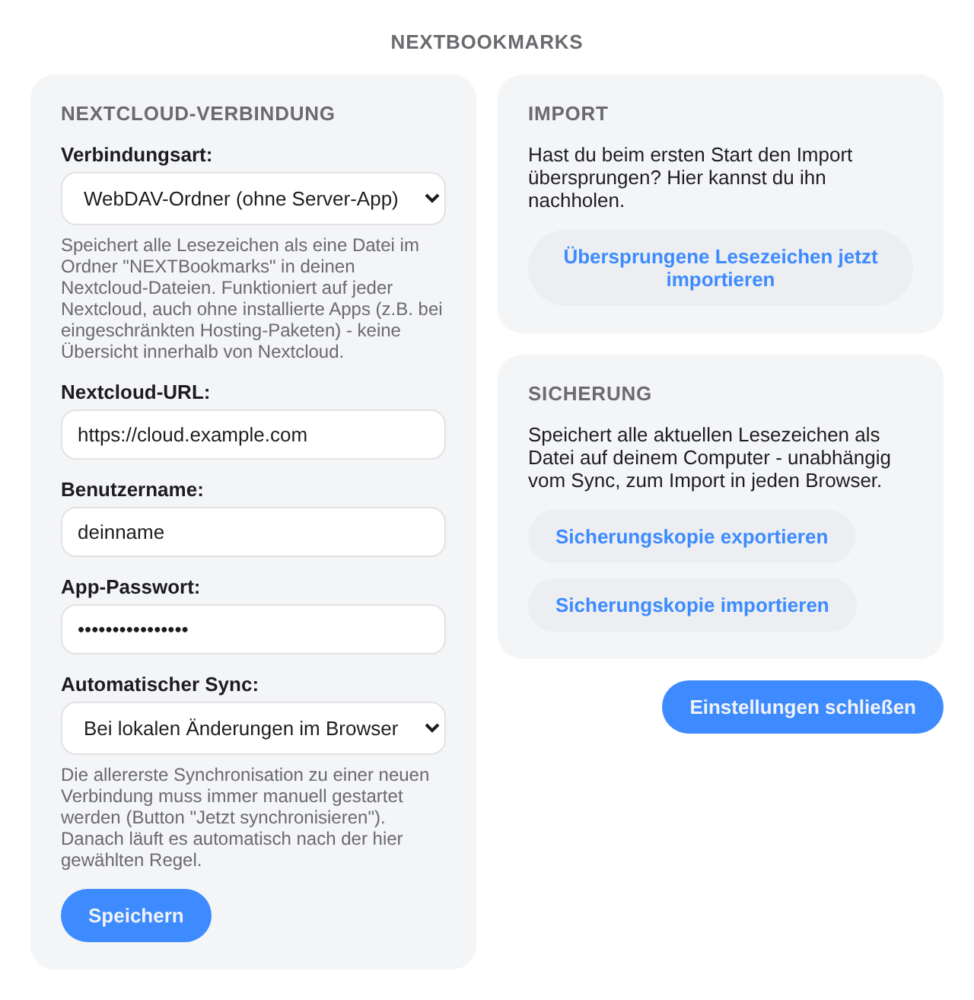
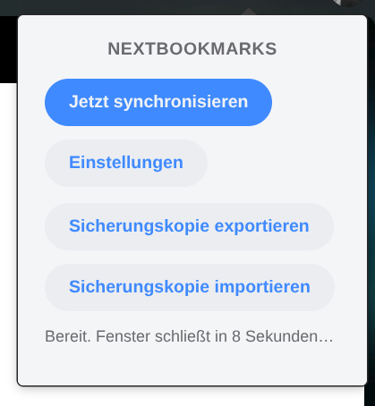

[Deutsch](README.md) | [English](README.en.md) | [Änderungsprotokoll](#änderungsprotokoll) | [TODO](TODO.md)

# NEXTBookmarks – Grundgerüst

Ein Tool, das Browser-Lesezeichen zentral über eine selbst gehostete Nextcloud
synchron hält – unabhängig von Browser und Betriebssystem.

Dieses Projekt ist in Zusammenarbeit mit [Claude](https://claude.com) entstanden.

**Installation:**
[Chrome Web Store](https://chromewebstore.google.com/detail/gkkfjlpedobidkhcihppighdomkjcihl) ·
[Firefox Add-ons](https://addons.mozilla.org/firefox/addon/nextbookmarks/)

## Wie die beiden Teile zusammenspielen

```
Chrome/Firefox/Edge  --(REST-API über HTTPS)-->  Nextcloud-App "nextbookmarks"
 (browser-extension/)                             (nextcloud-app/, PHP)
                                                          |
                                                     Nextcloud-Datenbank
```

- **nextcloud-app/**: Läuft auf deinem Nextcloud-Server. Speichert alle
  Lesezeichen in einer eigenen Datenbanktabelle und bietet sie über eine
  REST-API an. Zusätzlich zeigt sie eine einfache Web-Oberfläche innerhalb
  von Nextcloud.
- **browser-extension/**: Läuft im Browser des Nutzers, liest die lokalen
  Lesezeichen aus (`chrome.bookmarks`-API, die auch Firefox unterstützt)
  und schickt neue Lesezeichen an die REST-API.

Weil die Extension nur Standard-Web-Technologien (WebExtension-API, fetch)
nutzt, läuft sie unverändert oder mit minimalen Anpassungen in Chrome,
Firefox und Edge. Und weil die App-Logik in Nextcloud liegt, spielt das
Betriebssystem des Servers keine Rolle.

## Zwei Verbindungsarten

In den Extension-Einstellungen wählst du unter "Verbindungsart", wie
synchronisiert wird:

- **Nextcloud-App (App Store)**: nutzt die REST-API der installierten
  `nextcloud-app` (siehe oben) – feingranular, mit eigener Web-Oberfläche
  innerhalb von Nextcloud. Setzt voraus, dass die App auf dem Server
  installiert ist (siehe "Nextcloud-App installieren" unten).
- **WebDAV-Ordner (ohne Server-App)**: speichert alle Lesezeichen als eine
  einzelne Datei im Ordner `NEXTBookmarks` in deinen Nextcloud-Dateien, über
  das Standard-WebDAV-Protokoll. **Es muss dafür nichts auf dem Server
  installiert werden** – funktioniert auf jeder Nextcloud, für die du
  Benutzername + App-Passwort hast, auch bei verwalteten Angeboten ohne
  SSH-/App-Store-Zugriff (z.B. Hetzner Storage Share). Der Nachteil: keine
  Übersichtsseite innerhalb von Nextcloud, und feingranularere
  Konflikterkennung ist wegen technischer Einschränkungen von WebDAV/CORS
  nicht möglich (siehe "Bekannte Grenzen" unten).

Beide Verbindungsarten teilen sich dieselbe Sync-Logik (Zwei-Wege-Sync,
Konfliktlösung, Sicherheitsnetz usw., siehe unten) – der Unterschied
steckt nur darin, wo/wie die Lesezeichen auf dem Server abgelegt werden.



## Ordnerstruktur

```
nextbookmarks/
├── nextcloud-app/
│   ├── appinfo/
│   │   ├── info.xml         # App-Metadaten (Name, Version, ...)
│   │   └── routes.php       # URL -> Controller-Zuordnung
│   ├── lib/
│   │   ├── AppInfo/Application.php   # Einstiegspunkt der App
│   │   ├── Controller/
│   │   │   ├── BookmarkController.php  # REST-API (für die Extension)
│   │   │   └── PageController.php      # Web-Oberfläche in Nextcloud
│   │   ├── Db/
│   │   │   ├── Bookmark.php         # Datenmodell
│   │   │   └── BookmarkMapper.php   # Datenbankzugriff
│   │   └── Migration/               # Legt die DB-Tabelle an
│   ├── templates/main.php    # HTML der Web-Oberfläche
│   ├── js/app.js             # JS der Web-Oberfläche
│   ├── css/style.css
│   └── composer.json
└── browser-extension/
    ├── manifest.json         # Extension-Konfiguration
    ├── background.js         # Sync-Logik (Kernstück, beide Verbindungsarten)
    ├── export-backup.js      # Lokale + Cloud-Sicherungskopie (Export/Import)
    ├── theme.css             # Gemeinsames Erscheinungsbild (hell/dunkel)
    ├── popup.html / popup.js # Popup-Menü ("Jetzt synchronisieren" usw.)
    ├── options.html / options.js  # Einstellungen (Server-URL, Zugangsdaten, ...)
    ├── onboarding.html / onboarding.js  # Import-Abfrage nach Installation
    └── _locales/de, _locales/en  # Übersetzungen (Deutsch/Englisch)
```

## Nextcloud-App installieren

Dieser Abschnitt gilt nur für die Verbindungsart **"Nextcloud-App (App
Store)"** (siehe "Zwei Verbindungsarten" oben). Nutzt du stattdessen
**"WebDAV-Ordner (ohne Server-App)"**, kannst du diesen Abschnitt komplett
überspringen – dafür ist keinerlei Installation auf dem Server nötig, du
trägst einfach Nextcloud-URL, Benutzername und App-Passwort direkt in der
Browser-Extension ein.

Für die App-Store-Variante ist die App selbst in beiden Fällen identisch –
der Unterschied liegt nur darin, wie viel Zugriff du auf den Server hast,
auf dem Nextcloud läuft.

### A) Selbst gehostete Nextcloud (eigener Server oder eigene VPS)

Gemeint ist jede Nextcloud-Installation, bei der du (oder dein Admin) vollen
Datei- und Terminalzugriff auf den Server habt – egal ob eigene Hardware,
ein Raspberry Pi zuhause oder ein gemieteter, unverwalteter Server
(z.B. ein "Hetzner Cloud Server", auf dem du Nextcloud selbst installiert hast).

1. Per SFTP/SSH auf den Server verbinden.
2. Ordner `nextcloud-app` nach `nextbookmarks` umbenennen und in den
   `apps/`-Ordner deiner Nextcloud-Installation kopieren
   (typischerweise `/var/www/nextcloud/apps/nextbookmarks`).
3. Rechte setzen, damit der Webserver-Nutzer die Dateien lesen kann, z.B.:
   ```
   chown -R www-data:www-data /var/www/nextcloud/apps/nextbookmarks
   ```
   (Nutzername kann je nach Server auch `apache` o.ä. sein.)
4. App aktivieren – entweder per Weboberfläche (Einstellungen → Apps →
   "Nicht aktivierte Apps" → "NEXTBookmarks" aktivieren) oder per Konsole:
   ```
   sudo -u www-data php occ app:enable nextbookmarks
   ```
5. Unter Nextcloud-Einstellungen → Sicherheit ein **App-Passwort** erzeugen
   (nicht dein normales Passwort verwenden!) – das brauchst du gleich in
   der Browser-Extension.

### B) Nextcloud bei einem Hosting-Anbieter (z.B. Hetzner Managed Nextcloud)

Viele Anbieter stellen eine **verwaltete** Nextcloud-Instanz bereit (du
bekommst nur einen Nextcloud-Zugang, keinen Server-/SSH-Zugriff). Dort lässt
sich normalerweise **nur der offizielle Nextcloud App Store** über die
Weboberfläche nutzen – eigene, unveröffentlichte Apps wie diese hier lassen
sich nicht einfach per Klick installieren.

**Einfachster Weg in diesem Fall: die Verbindungsart "WebDAV-Ordner (ohne
Server-App)" wählen** (siehe "Zwei Verbindungsarten" oben) – das
funktioniert auch bei **Hetzner Storage Share** und anderen Angeboten ohne
jeglichen SSH-/Root-Zugriff, weil dabei nichts auf dem Server installiert
werden muss. Alternativ gibt es diese Wege, um trotzdem die App-Store-Variante
nutzen zu können:

1. **Beim Anbieter nachfragen**: Manche Hosting-Pakete enthalten trotzdem
   SFTP-Zugriff auf den `apps/`-Ordner, oder der Support installiert eine
   eigene App auf Anfrage. Kurz beim Anbieter nachfragen lohnt sich – falls
   ja, einfach mit den Schritten aus Bereich A weitermachen.
   *Ausnahme: Bei **Hetzner Storage Share** ist das explizit ausgeschlossen
   – dort gibt es keinerlei SSH-/Root-Zugriff und es lassen sich nur Apps
   aus dem offiziellen Nextcloud App Store aktivieren.*
2. **Auf einen eigenen (unverwalteten) Server wechseln**: z.B. einen
   "Hetzner Cloud Server" (VPS) statt des Managed-Nextcloud-Produkts mieten
   und Nextcloud dort selbst installieren – dann greift wieder Bereich A
   mit vollem Zugriff.
3. **App im offiziellen App Store veröffentlichen**: Für den dauerhaften,
   breiteren Einsatz könnte man NEXTBookmarks bei
   [apps.nextcloud.com](https://apps.nextcloud.com) einreichen (inkl.
   Code-Signierung und Review durch Nextcloud). Das lohnt sich erst, wenn
   die App über das Testen hinaus stabil laufen soll – ein Schritt, den wir
   uns bei Bedarf später gemeinsam anschauen können.

In allen Fällen gilt: Sobald die App aktiv ist, richtest du in der
Browser-Extension einfach die Nextcloud-URL, deinen Benutzernamen und ein
App-Passwort ein (siehe unten) – die Extension merkt nicht, ob die
Nextcloud selbst gehostet oder bei einem Anbieter läuft.

### C) Schnelltest: lokale Nextcloud per Docker auf deinem PC

Wenn du (wie bei Hetzner Storage Share) keinen eigenen Server hast, aber
trotzdem testen willst, ist eine lokale Test-Instanz per Docker der
schnellste, kostenlose Weg – komplett unabhängig von deiner produktiven
Hetzner-Cloud.

**Voraussetzung**: [Docker Desktop](https://www.docker.com/products/docker-desktop/)
installiert (Windows, Mac oder Linux).

1. Terminal öffnen und eine Test-Nextcloud starten:
   ```
   docker run -d --name nextcloud-test -p 8080:80 -v nextcloud-test-data:/var/www/html nextcloud
   ```
2. Im Browser `http://localhost:8080` öffnen und ein Admin-Konto anlegen.
3. Die App in den Container kopieren und aktivieren:
   ```
   docker cp nextcloud-app nextcloud-test:/var/www/html/apps/nextbookmarks
   docker exec -u www-data nextcloud-test php occ app:enable nextbookmarks
   ```
   (Falls `chown`-Fehler auftreten: `docker exec nextcloud-test chown -R www-data:www-data /var/www/html/apps/nextbookmarks`)
4. Unter `http://localhost:8080` → Einstellungen → Sicherheit ein
   App-Passwort erzeugen.
5. In der Browser-Extension als Nextcloud-URL `http://localhost:8080`
   eintragen (das Manifest erlaubt dafür extra `http://localhost/*`,
   sonst ist standardmäßig nur `https://` zugelassen).

Die Test-Instanz läuft komplett isoliert in Docker – sie hat nichts mit
deiner echten Hetzner-Cloud zu tun, und du kannst sie jederzeit mit
`docker rm -f nextcloud-test` wieder entfernen.

## Browser-Extension laden

Am einfachsten direkt über den Store installieren (siehe Links oben) –
bei Vivaldi/Edge/Brave/Opera funktioniert der Chrome-Web-Store-Eintrag
ebenfalls. Für die Entwicklung bzw. um eine lokal geänderte Version zu
testen:

1. Chrome/Edge: `chrome://extensions` öffnen → "Entwicklermodus" aktivieren
   → "Entpackte Erweiterung laden" → Ordner `browser-extension` auswählen.
   Die Erweiterung erscheint dann in der Liste "Alle Erweiterungen":

   
2. In den Extension-Einstellungen die Nextcloud-URL, deinen Benutzernamen
   und das App-Passwort eintragen.
3. Über das Extension-Icon in der Browserleiste

   

   → "Jetzt synchronisieren" klicken.

## Was jetzt bereits funktioniert

- **Zwei-Wege-Sync**: neue Lesezeichen werden in beide Richtungen übertragen,
  Änderungen (Titel, Ordner) ebenso, und Löschungen werden auf der jeweils
  anderen Seite nachvollzogen.
- **Konfliktlösung** (bewusst einfach gehalten): Wurde ein Lesezeichen auf
  beiden Seiten seit dem letzten Abgleich verändert, gewinnt die Seite mit
  dem neueren Zeitstempel. Da Browser für einzelne Lesezeichen keine
  zuverlässige "zuletzt geändert"-Zeit liefern, ist das eine pragmatische
  Näherung – für den Alltag reicht sie, für einen produktiven Einsatz wäre
  ein sauberer, revisionierter Abgleich der nächste Ausbauschritt.
- **Kein zentraler "Master"**: Nextcloud ist kein bevorzugter Master, dem
  der Browser blind folgt, sondern die gemeinsame Ablage, über die sich
  mehrere Geräte gegenseitig abgleichen – Änderungen laufen in beide
  Richtungen, entschieden wird pro Lesezeichen (siehe Konfliktlösung
  oben). Möglich wird das, weil der Abgleich nicht nur "lokal vs. Server"
  vergleicht, sondern zusätzlich den *letzten bekannten Stand* aus dem
  vorherigen Sync mit einbezieht (`syncState`, siehe Kommentar am Anfang
  von `background.js`). Richtest du die Extension auf einem neuen/leeren
  Gerät ein, ist für dieses Gerät (dessen `syncState` ja leer ist) jedes
  Cloud-Lesezeichen "neu, nie gesehen" → es wird heruntergeladen, nicht
  gelöscht. Gelöscht wird nur, wenn ein Gerät sich aktiv erinnert "das
  kannte ich früher lokal, jetzt ist es weg".
- **Ordnerstruktur**: Der Ordnerpfad (z.B. `Lesezeichenleiste/Arbeit`) wird
  mit übertragen; beim Herunterladen werden fehlende Ordner lokal automatisch
  angelegt.
- **Automatischer Sync (konfigurierbar)**: in den Einstellungen wählbar
  zwischen "Bei lokalen Änderungen im Browser" (entprellt, 5 Sekunden nach
  der letzten Änderung) und "Beim Schließen des Browsers" (best-effort,
  siehe Hinweis am `chrome.windows.onRemoved`-Listener in `background.js` -
  während eines tatsächlichen Browser-Shutdowns ist das nicht immer
  zuverlässig). Zusätzlich läuft alle 15 Minuten ein Hintergrund-Sync
  (`browser.alarms`). **Die allererste Synchronisation zu einer neuen
  Verbindung muss immer manuell über den Button "Jetzt synchronisieren"
  gestartet werden** – erst danach greift die automatische Regel. So lässt
  sich vor dem ersten (potenziell folgenreichen) automatischen Lauf noch
  prüfen, ob wirklich der richtige Server/das richtige Konto eingetragen ist.
- **Sicherungskopie exportieren/importieren**: Export speichert alle
  aktuellen Lesezeichen als HTML-Datei im Netscape-Bookmark-Format
  (importierbar in jeden Browser) – lokal auf dem Rechner und zusätzlich
  automatisch in die Cloud hochgeladen (`NEXTBookmarks/backups/`, per
  WebDAV, unabhängig von der gewählten Verbindungsart). Import einer
  Sicherungskopie legt die enthaltenen Lesezeichen in einem neuen,
  isolierten Ordner an, ohne bestehende Lesezeichen zu verändern.
- **Sicherheitsnetz gegen Massenlöschung**: Würde ein Sync mehr als die
  Hälfte der bekannten Lesezeichen löschen (z.B. weil versehentlich der
  falsche Server/Account eingetragen wurde), bricht er komplett ab, statt
  die Löschung durchzuführen – mit einer Fehlermeldung, die zur Prüfung der
  Zugangsdaten auffordert.
- **Cross-Browser-Kompatibilität**: `browser-polyfill-shim.js` sorgt dafür,
  dass derselbe Code einheitlich `browser.*` (Promises) nutzen kann - auch
  in Browsern, die nur das ältere, callback-basierte `chrome.*` anbieten.
  `manifest.json` listet für den Hintergrund-Prozess bewusst sowohl
  `service_worker` (Chrome/Edge/Vivaldi/Brave/Opera) als auch `scripts`
  (von Firefox für MV3-Hintergrundskripte benötigt, da Firefox dort keinen
  echten Service Worker nutzt).
  - **Chromium-basierte Browser** (Chrome, Edge, Vivaldi, Brave, Opera):
    live getestet - Erweiterung lädt, Service Worker startet, alle Seiten
    (Popup/Einstellungen/Onboarding) sowie die Lesezeichen-Sync-Nachricht
    funktionieren fehlerfrei.
  - **Firefox**: live getestet (temporäres Add-on über `about:debugging`,
    inkl. Verbindung zu einer echten Nextcloud) - funktioniert. Für den
    Firefox-Store wäre zusätzlich die reguläre Signierung/Veröffentlichung
    nötig; die `gecko.id` im Manifest ist dafür schon vorbereitet.
  - **Safari**: aktuell nicht unterstützt - siehe Hinweis weiter unten.
- **Onboarding-Import-Abfrage**: Direkt nach der Installation (bzw. sobald
  du die Nextcloud-Zugangsdaten in den Einstellungen gespeichert hast)
  öffnet sich automatisch `onboarding.html` mit der Frage, ob deine
  vorhandenen lokalen Lesezeichen importiert werden sollen.
  - **Ja** → löst sofort einen Sync aus, alle vorhandenen Lesezeichen
    werden hochgeladen.
  - **Nein** → diese Lesezeichen werden dauerhaft vom Sync ignoriert
    (weder hoch- noch heruntergeladen). Über den Button "Übersprungene
    Lesezeichen jetzt importieren" in den Einstellungen kannst du das
    jederzeit nachholen.
- **Icon**: `browser-extension/icons/` enthält ein blaues Icon in 16/48/128px
  (Lesezeichen-Form mit Sync-Pfeilen), erzeugt aus `icon-source.svg`.
  Dasselbe Icon liegt auch unter `nextcloud-app/img/` für die Web-Oberfläche.
- **Popup-Menü**: schließt sich automatisch nach 10 Sekunden Inaktivität
  (mit sichtbarem Countdown "Fenster schließt in ... Sekunden"), jeder Klick
  setzt den Timer zurück. Von hier aus erreichbar: Sync, Einstellungen
  (öffnen sich als eigenes, passend großes Fenster statt als Browser-Tab)
  sowie Sicherungskopie exportieren/importieren.

  
- **Web-Oberfläche** (innerhalb von Nextcloud, Menüpunkt "NEXTBookmarks"):
  Lesezeichen werden nach Ordner gruppiert dargestellt; ein Klick auf
  einen Ordner klappt Titel (fett) und URL (klickbar, öffnet in neuem
  Tab) der enthaltenen Lesezeichen auf. Ordner erscheinen in derselben
  Reihenfolge wie im Browser-Lesezeichenbaum, Papierkorb-Ordner immer
  ganz am Ende. Die Textfarbe passt sich automatisch an das aktive
  Nextcloud-Theme (hell/dunkel) an.

## Entwicklung / lokale Änderungen testen

Wenn du am Code weiterarbeitest und über die Docker-Testinstanz
(siehe Bereich C oben) prüfen willst, ob eine Änderung funktioniert:

1. Geänderte Datei in den laufenden Container kopieren, z.B.:
   ```
   docker cp nextcloud-app/js/app.js nextcloud-test:/var/www/html/apps/nextbookmarks/js/app.js
   docker exec nextcloud-test chown www-data:www-data /var/www/html/apps/nextbookmarks/js/app.js
   ```
2. **Nur bei Änderungen an einer Migration** (neue/geänderte Spalte in
   `lib/Migration/`) zusätzlich die App einmal deaktivieren/aktivieren,
   damit die Migration ausgeführt wird:
   ```
   docker exec -u www-data nextcloud-test php occ app:disable nextbookmarks
   docker exec -u www-data nextcloud-test php occ app:enable nextbookmarks
   ```
3. **Browser-Cache beachten**: Nextcloud liefert `js/app.js` und
   `css/style.css` mit einem sehr langen `Cache-Control`-Header aus
   (mehrere Monate). Nach jeder Änderung an diesen beiden Dateien
   unbedingt mit **Strg+Umschalt+R** (Hard-Reload) neu laden, sonst
   sieht es so aus, als hätte sich nichts geändert, obwohl der Server
   die neue Version längst ausliefert.
4. Änderungen an `browser-extension/*.js` betreffen nicht den
   Nextcloud-Container, sondern die geladene Erweiterung selbst: in
   `chrome://extensions` bzw. `vivaldi://extensions` bei NEXTBookmarks
   auf den Reload-Pfeil (⟳) klicken.

## Bekannte Grenzen / mögliche nächste Schritte

- Konfliktlösung basiert auf einer Vereinfachung (siehe oben) statt echter
  Versionierung.
- Der Sync-Zustand liegt lokal je Browser-Profil (`browser.storage.local`),
  indiziert über die stabile lokale Browser-ID jedes Lesezeichens (nicht
  die URL, da dieselbe Adresse mehrfach vorkommen kann). Bei einer
  Neuinstallation der Extension ist dieser Zustand leer; der erste Sync
  danach erkennt bereits vorhandene Cloud-Lesezeichen anhand von
  URL+Ordner automatisch wieder, statt sie zu duplizieren.
- Für sehr viele Lesezeichen (mehrere Tausend) wäre eine effizientere,
  inkrementelle API (z.B. "nur Änderungen seit Zeitpunkt X") sinnvoll statt
  jedes Mal die komplette Liste zu laden.
- **WebDAV-Modus, technische Einschränkung**: Aus CORS-Gründen ist der
  `ETag`-Header einer WebDAV-Antwort im Browser nicht auslesbar (nicht Teil
  der standardmäßig freigegebenen Response-Header). Die Konflikterkennung
  beim Schreiben nutzt deshalb `Last-Modified`/`If-Unmodified-Since` statt
  `ETag`/`If-Match` – funktional gleichwertig, aber mit Sekunden- statt
  Millisekunden-Genauigkeit.
- **Safari: aktuell nicht unterstützt.** Zwei getrennte Hürden:
  1. *Build/Vertrieb*: Safari-Erweiterungen lassen sich nicht wie bei
     Chrome/Firefox einfach "entpackt laden" – sie müssen mit Apples
     `safari-web-extension-converter` in ein natives macOS/iOS-App-Bundle
     umgewandelt und über Xcode gebaut/signiert werden. Das setzt einen
     Mac mit Xcode voraus; in der aktuellen (Linux-)Entwicklungsumgebung
     ist das nicht möglich.
  2. *API-Lücke*: Safaris WebExtension-Unterstützung deckt die
     `bookmarks`-API – auf der diese gesamte Erweiterung aufbaut – nach
     aktuellem Kenntnisstand nicht ab. Das wäre kein kleiner Kompatibilitäts-
     Fix, sondern würde eine grundlegend andere Umsetzung für Safari
     erfordern (falls überhaupt möglich). Das müsste zuerst mit einem
     echten Mac verifiziert werden, bevor sich eine Safari-Portierung
     überhaupt sinnvoll planen lässt.

## Änderungsprotokoll

Bezieht sich auf die Versionsnummer der Browser-Erweiterung
(`browser-extension/manifest.json`), die auch im Popup angezeigt wird.

### 0.1.2
- Popup zeigt jetzt die aktuell installierte Versionsnummer an.
- Link zum GitHub-Repository im Popup ergänzt.

### 0.1.1
- Verbindungsart "Nextcloud-App (App Store)" im Einstellungen-Dropdown
  ausgegraut, solange die App noch nicht im offiziellen Nextcloud App
  Store freigegeben ist - WebDAV ist seitdem die Standard-Verbindungsart
  für neue Installationen.
- Der Hinweis dazu ist jetzt dauerhaft (statt nur bei ausgewählter
  Verbindungsart) sichtbar und rot statt nur fett hervorgehoben.

### 0.1.0
Erste veröffentlichte Version (Chrome Web Store und Firefox Add-ons):
- Zwei-Wege-Sync zwischen Browser-Lesezeichen und Nextcloud (neue,
  geänderte, gelöschte Lesezeichen, inkl. Ordnerstruktur).
- Zwei Verbindungsarten: Nextcloud-App (REST-API) oder WebDAV-Ordner
  (ohne Server-App, funktioniert auf jeder Nextcloud).
- Konfigurierbarer automatischer Sync (bei lokalen Änderungen oder beim
  Schließen des Browsers), erste Synchronisation immer manuell.
- Sicherungskopie-Export/-Import (lokal und automatisch in die Cloud).
- Sicherheitsnetz gegen versehentliche Massenlöschung.
- Deutsch und Englisch.
- Chrome/Edge/Vivaldi/Brave/Opera und Firefox unterstützt; für Firefox
  eigens angepasste `browser.*`-API-Nutzung statt Chrome-spezifischem
  `chrome.*`.
- Berechtigungen erst zur Laufzeit für die eingetragene Nextcloud-Domain
  angefragt, nicht pauschal beim Installieren.

## Bugs melden

Die `<bugs>`-Adresse in `nextcloud-app/appinfo/info.xml` zeigt auf
[github.com/Stephan-Lefty/nextbookmarks/issues](https://github.com/Stephan-Lefty/nextbookmarks/issues) -
dort können Fehler und Ideen für nächste Schritte eingetragen werden.

## Datenschutz

Siehe [PRIVACY.md](PRIVACY.md) für die Datenschutzerklärung der
Browser-Erweiterung.

## Lizenz

MIT, siehe [LICENSE](LICENSE).
